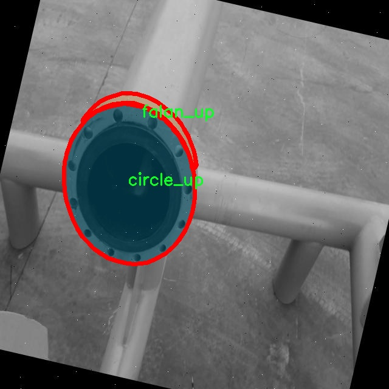

# 法兰图像分割系统： yolov8-seg-C2f-REPVGGOREPA

### 1.研究背景与意义

[参考博客](https://gitee.com/YOLOv8_YOLOv11_Segmentation_Studio/projects)

[博客来源](https://kdocs.cn/l/cszuIiCKVNis)

研究背景与意义

随着计算机视觉技术的快速发展，图像分割作为其重要分支之一，已经在多个领域中得到了广泛应用，如自动驾驶、医学影像分析、工业检测等。尤其是在物体识别和分类任务中，图像分割技术能够提供更为精确的物体边界信息，从而提升后续处理的准确性和效率。近年来，YOLO（You Only Look Once）系列模型因其高效的实时检测能力而受到广泛关注，尤其是YOLOv8版本的推出，进一步提升了目标检测的精度和速度。然而，尽管YOLOv8在目标检测上表现出色，但在复杂背景下的图像分割任务中仍存在一定的局限性。因此，基于改进YOLOv8的法兰图像分割系统的研究具有重要的学术价值和实际意义。

本研究旨在针对法兰图像的特征，开发一种基于改进YOLOv8的实例分割系统。法兰作为机械连接的重要部件，其在工业生产中的应用广泛，尤其是在管道、阀门等设备的连接中，法兰的质量直接影响到整个系统的安全性和稳定性。因此，开发高效的法兰图像分割系统，不仅能够提高法兰的检测效率，还能为后续的质量控制提供有力支持。我们所使用的数据集包含1200张图像，涵盖了两类目标：circle_up和falan_up。这些数据的多样性和丰富性为模型的训练和验证提供了良好的基础。

在图像分割任务中，如何准确地识别和分割出目标物体的边界是一个关键问题。传统的图像分割方法往往依赖于手工特征提取，难以适应复杂多变的实际场景。而基于深度学习的YOLOv8模型通过端到端的学习方式，能够自动提取特征，显著提高了分割的精度和效率。然而，针对特定领域的图像分割任务，单一的YOLOv8模型可能无法充分挖掘目标的细节信息。因此，改进YOLOv8以适应法兰图像的特征，将有助于提升模型在实例分割任务中的表现。

此外，法兰图像分割系统的研究还具有重要的社会和经济意义。随着工业自动化和智能制造的不断推进，企业对生产过程中的质量控制要求日益提高。通过引入高效的图像分割技术，能够在生产线上实现对法兰等关键部件的实时监测和质量评估，从而降低人为错误，提高生产效率，减少资源浪费。这不仅有助于提升企业的竞争力，也为推动行业的智能化转型提供了技术支持。

综上所述，基于改进YOLOv8的法兰图像分割系统的研究，不仅具有重要的理论价值，还在实际应用中展现出广阔的前景。通过深入探索该领域的技术创新，期望能够为工业生产中的图像处理提供新的解决方案，推动相关技术的发展与应用。

### 2.图片演示


注意：本项目提供完整的训练源码数据集和训练教程,由于此博客编辑较早,暂不提供权重文件（best.pt）,需要按照6.训练教程进行训练后实现上图效果。

### 3.视频演示

[3.1 视频演示](https://www.bilibili.com/video/BV1mtzGYDESq/)

### 4.数据集信息

##### 4.1 数据集类别数＆类别名

nc: 2
names: ['circle_up', 'falan_up']


##### 4.2 数据集信息简介

数据集信息展示

在本研究中，我们采用了名为“falan_up_new”的数据集，以训练和改进YOLOv8-seg的法兰图像分割系统。该数据集专门针对法兰图像的特征进行标注和分类，旨在提升图像分割模型在工业应用中的准确性和鲁棒性。数据集包含两种主要类别，分别为“circle_up”和“falan_up”，这两类的选择不仅涵盖了法兰图像的基本特征，还考虑到了在实际应用中可能遇到的多样性和复杂性。

“circle_up”类别主要包括那些呈现圆形上部特征的法兰图像，这些图像通常具有较为简单的几何形状，便于模型进行初步的特征学习。通过对这一类别的样本进行标注，模型能够有效识别和分割出圆形区域，从而为后续的图像处理和分析提供基础。此类别的样本数量经过精心挑选，确保涵盖了不同的拍摄角度、光照条件和背景干扰，以增强模型的泛化能力。

另一方面，“falan_up”类别则聚焦于法兰的整体特征，包含了更为复杂的形状和细节。这一类别的样本不仅包括法兰的上部特征，还涉及到法兰的边缘、连接部分以及其他可能影响分割效果的细节。通过对这一类别的样本进行深入分析，模型能够学习到法兰在不同环境下的表现，进而提高其在实际应用中的分割精度。

数据集“falan_up_new”的构建过程遵循了严格的标注标准，确保每一张图像的标注都经过专业人员的审核。这一过程不仅提升了数据集的质量，也为后续的模型训练提供了可靠的基础。数据集中的图像数量经过合理配置，以保证在训练过程中能够充分覆盖各个类别的特征，同时避免因样本不足而导致的过拟合现象。

在训练过程中，我们将采用数据增强技术，以进一步提升模型的鲁棒性和适应性。通过对原始图像进行旋转、缩放、翻转等操作，模型将能够接触到更多样化的输入，从而提高其在真实场景中的表现。此外，数据集的划分也经过精心设计，确保训练集、验证集和测试集之间的平衡，使得模型在训练过程中能够有效评估其性能。

总之，数据集“falan_up_new”不仅为YOLOv8-seg的法兰图像分割系统提供了丰富的训练素材，还通过科学的标注和合理的样本选择，为模型的优化奠定了坚实的基础。随着模型的不断训练和改进，我们期待能够在法兰图像分割领域取得更为显著的成果，为相关工业应用提供更为精准和高效的解决方案。




### 5.项目依赖环境部署教程（零基础手把手教学）

[5.1 环境部署教程链接（零基础手把手教学）](https://www.bilibili.com/video/BV1jG4Ve4E9t/?vd_source=bc9aec86d164b67a7004b996143742dc)


[5.2 安装Python虚拟环境创建和依赖库安装视频教程链接（零基础手把手教学）](https://www.bilibili.com/video/BV1nA4VeYEze/?vd_source=bc9aec86d164b67a7004b996143742dc)

### 6.手把手YOLOV8-seg训练视频教程（零基础手把手教学）

[6.1 手把手YOLOV8-seg训练视频教程（零基础小白有手就能学会）](https://www.bilibili.com/video/BV1cA4VeYETe/?vd_source=bc9aec86d164b67a7004b996143742dc)


按照上面的训练视频教程链接加载项目提供的数据集，运行train.py即可开始训练



     Epoch   gpu_mem       box       obj       cls    labels  img_size
     1/200     0G   0.01576   0.01955  0.007536        22      1280: 100%|██████████| 849/849 [14:42<00:00,  1.04s/it]
               Class     Images     Labels          P          R     mAP@.5 mAP@.5:.95: 100%|██████████| 213/213 [01:14<00:00,  2.87it/s]
                 all       3395      17314      0.994      0.957      0.0957      0.0843

     Epoch   gpu_mem       box       obj       cls    labels  img_size
     2/200     0G   0.01578   0.01923  0.007006        22      1280: 100%|██████████| 849/849 [14:44<00:00,  1.04s/it]
               Class     Images     Labels          P          R     mAP@.5 mAP@.5:.95: 100%|██████████| 213/213 [01:12<00:00,  2.95it/s]
                 all       3395      17314      0.996      0.956      0.0957      0.0845

     Epoch   gpu_mem       box       obj       cls    labels  img_size
     3/200     0G   0.01561    0.0191  0.006895        27      1280: 100%|██████████| 849/849 [10:56<00:00,  1.29it/s]
               Class     Images     Labels          P          R     mAP@.5 mAP@.5:.95: 100%|███████   | 187/213 [00:52<00:00,  4.04it/s]
                 all       3395      17314      0.996      0.957      0.0957      0.0845


### 7.50+种全套YOLOV8-seg创新点加载调参实验视频教程（一键加载写好的改进模型的配置文件）

[7.1 50+种全套YOLOV8-seg创新点加载调参实验视频教程（一键加载写好的改进模型的配置文件）](https://www.bilibili.com/video/BV1Hw4VePEXv/?vd_source=bc9aec86d164b67a7004b996143742dc)

### YOLOV8-seg算法简介

原始YOLOV8-seg算法原理

YOLOv8-seg算法是YOLO系列模型中的一个重要版本，旨在解决目标检测和分割任务中的一些挑战。该算法的设计基于YOLOv8的架构，并引入了一些关键的改进，以提高其在复杂环境下的性能。YOLOv8-seg采用了anchor-free的方法，这一策略相较于传统的anchor-based检测方法，能够显著提升检测精度和速度。通过直接预测目标的中心点，YOLOv8-seg减少了对锚框的依赖，使得模型在处理不同尺度和形状的目标时更加灵活。

在YOLOv8-seg的架构中，主要分为输入端、主干网络、Neck端和输出端四个模块。输入端通过Mosaic数据增强、自适应图片缩放和灰度填充等技术对输入图像进行预处理，这一过程不仅提高了模型的鲁棒性，还增强了其对多样化背景的适应能力。主干网络则负责特征提取，采用了卷积、池化等操作，结合C2f模块和SPPF结构，能够有效捕捉图像中的细节信息。

Neck端的设计基于路径聚合网络（PAN），通过上采样和下采样的方式实现不同尺度特征图的融合。这一过程对于小目标的检测尤为重要，因为小目标往往在不同尺度下表现出不同的特征。YOLOv8-seg在Neck端引入了GSConv和Slim-neck技术，旨在保持模型的精度同时降低计算量，从而提升检测速度和效率。

输出端则采用了解耦头结构，将分类和回归任务分开处理。这一设计使得模型在进行目标分类和定位时能够更好地聚焦于各自的任务，从而提高了整体的检测精度。YOLOv8-seg还引入了Task-Aligned Assigner方法，通过对分类分数和回归分数的加权匹配正样本，进一步提升了模型的性能。

尽管YOLOv8-seg在许多方面表现出色，但在复杂水面环境下，尤其是对于小目标漂浮物的检测，仍然存在一定的挑战。这些小目标往往具有复杂的特征和多样的背景，导致模型在定位和感知能力上出现不足。为了解决这些问题，YOLOv8-seg在设计上进行了多项改进。

首先，YOLOv8-seg引入了BiFormer双层路由注意力机制，以捕获远程依赖关系。这一机制能够在特征提取过程中保留更细粒度的上下文信息，从而减轻主干网络下采样过程中的噪声影响。通过增强模型对上下文信息的理解，YOLOv8-seg在处理复杂背景时能够更准确地识别目标。

其次，为了提升网络对小目标的感知能力，YOLOv8-seg添加了一个更小的检测头。这一检测头专门针对小目标进行优化，使得模型在面对小目标时能够更敏感地捕捉到其特征。此外，MPDIoU损失函数的引入替代了传统的CIoU损失函数，进一步提高了模型的泛化能力和精准度。这一损失函数通过综合考虑目标的中心点、宽高比和面积等多个因素，使得模型在训练过程中能够更好地学习到目标的真实位置。

在训练过程中，YOLOv8-seg还采取了停止使用Mosaic数据增强的策略，以避免在最后阶段模型学习到不良信息。这一细节的调整，反映了YOLOv8-seg在训练策略上的灵活性和针对性，旨在最大限度地提升模型的性能。

总的来说，YOLOv8-seg算法在YOLOv8的基础上，通过引入多种先进的技术和策略，显著提升了目标检测和分割的能力。其在处理复杂环境下的小目标检测时，表现出更高的精度和速度，充分展现了YOLO系列模型在计算机视觉领域的强大潜力。随着对YOLOv8-seg算法的深入研究和应用，未来有望在更多实际场景中发挥重要作用，推动目标检测技术的进一步发展。


### 9.系统功能展示（检测对象为举例，实际内容以本项目数据集为准）

图9.1.系统支持检测结果表格显示

  图9.2.系统支持置信度和IOU阈值手动调节

  图9.3.系统支持自定义加载权重文件best.pt(需要你通过步骤5中训练获得)

  图9.4.系统支持摄像头实时识别

  图9.5.系统支持图片识别

  图9.6.系统支持视频识别

  图9.7.系统支持识别结果文件自动保存

  图9.8.系统支持Excel导出检测结果数据


### 10.50+种全套YOLOV8-seg创新点原理讲解（非科班也可以轻松写刊发刊，V11版本正在科研待更新）

#### 10.1 由于篇幅限制，每个创新点的具体原理讲解就不一一展开，具体见下列网址中的创新点对应子项目的技术原理博客网址【Blog】：


[10.1 50+种全套YOLOV8-seg创新点原理讲解链接](https://gitee.com/qunmasj/good)

#### 10.2 部分改进模块原理讲解(完整的改进原理见上图和技术博客链接)【如果此小节的图加载失败可以通过CSDN或者Github搜索该博客的标题访问原始博客，原始博客图片显示正常】
### YOLOv8简介

YOLOv8 是 Ultralytics 公司继 YOLOv5 算法之后开发的下一代算法模型，目前支持图像分类、物体检测和实例分割任务。YOLOv8 是一个 SOTA 模型，它建立在之前YOLO 系列模型的成功基础上，并引入了新的功能和改进，以进一步提升性能和灵活性。具体创新包括：一个新的骨干网络、一个新的 Ancher-Free 检测头和一个新的损失函数，可以在从 CPU 到 GPU 的各种硬件平台上运行。注意到ultralytics 并没有直接将开源库命名为 YOLOv8，而是直接使用 Ultralytics这个单词，原因是Ultralytics这个库的定位是算法框架，而非特指某一个特定算法，其希望这个库不仅仅能够用于 YOLO 系列模型，同时也能支持其他的视觉任务如图像分类、实例分割等。下图画图YOLOv8目标检测算法同其他YOLO系列算法（YOLOv5、6、7）的实验对比图，左边是模型参数量对比，右边是速度对比。


下面两个表分别是YOLOv8和YOLOv5（v7.0版本）官方在 COCO Val 2017 数据集上测试结果，从中看出 YOLOv8 相比 YOLOv5 精度提升大，但是 N/S/M 模型相应的参数量、FLOPS等提高了不少。


#### YOLOv8概述
提供了一个全新的SOTA模型，和YOLOv5一样，基于缩放系数也提供了 N/S/M/L/X 尺度的不同大小模型，用于满足不同场景需求，同时支持图像分类、目标检测、实例分割和姿态检测任务
在骨干网络和Neck部分将YOLOv5的C3结构换成了梯度流更丰富的 C2f 结构，并对不同尺度模型调整了不同的通道数，大幅提升了模型性能；需要注意的是C2f 模块中存在Split等操作对特定硬件部署没有之前那么友好


Head部分换成了目前主流的解耦头结构，将分类和检测头分离，同时也从 Anchor-Based换成了Anchor-Free Loss
计算方面采用了 TaskAlignedAssigner 正样本分配策略，并引入了 Distribution Focal Loss
下图画出YOLOv8目标检测算法的整体结构图


#### YOLOv8模型
YOLOv8目标检测算法的模型配置文件如下：


从配置文件可以看出，YOLOv8与YOLOv5模型最明显的差异是使用C2F模块替换了原来的C3模块，两个模块的结构图下图所示。


另外Head 部分变化最大，从原先的耦合头变成了解耦头，并且从 YOLOv5 的 Anchor-Based 变成了 Anchor-Free。其结构对比图如下所示：

### RepViT简介

近年来，与轻量级卷积神经网络(cnn)相比，轻量级视觉变压器(ViTs)在资源受限的移动设备上表现出了更高的性能和更低的延迟。这种改进通常归功于多头自注意模块，它使模型能够学习全局表示。然而，轻量级vit和轻量级cnn之间的架构差异还没有得到充分的研究。在这项研究中，我们重新审视了轻量级cnn的高效设计，并强调了它们在移动设备上的潜力。通过集成轻量级vit的高效架构选择，我们逐步增强了标准轻量级CNN的移动友好性，特别是MobileNetV3。这就产生了一个新的纯轻量级cnn家族，即RepViT。大量的实验表明，RepViT优于现有的轻型vit，并在各种视觉任务中表现出良好的延迟。在ImageNet上，RepViT在iPhone 12上以近1ms的延迟实现了超过80%的top-1精度，据我们所知，这是轻量级模型的第一次。

#### RepViT简介
轻量级模型研究一直是计算机视觉任务中的一个焦点，其目标是在降低计算成本的同时达到优秀的性能。轻量级模型与资源受限的移动设备尤其相关，使得视觉模型的边缘部署成为可能。在过去十年中，研究人员主要关注轻量级卷积神经网络（CNNs）的设计，提出了许多高效的设计原则，包括可分离卷积 、逆瓶颈结构 、通道打乱 和结构重参数化等，产生了 MobileNets ，ShuffleNets和 RepVGG 等代表性模型。

另一方面，视觉 Transformers（ViTs）成为学习视觉表征的另一种高效方案。与 CNNs 相比，ViTs 在各种计算机视觉任务中表现出了更优越的性能。然而，ViT 模型一般尺寸很大，延迟很高，不适合资源受限的移动设备。因此，研究人员开始探索 ViT 的轻量级设计。许多高效的ViTs设计原则被提出，大大提高了移动设备上 ViTs 的计算效率，产生了EfficientFormers ，MobileViTs等代表性模型。这些轻量级 ViTs 在移动设备上展现出了相比 CNNs 的更强的性能和更低的延迟。

轻量级 ViTs 优于轻量级 CNNs 的原因通常归结于多头注意力模块，该模块使模型能够学习全局表征。然而，轻量级 ViTs 和轻量级 CNNs 在块结构、宏观和微观架构设计方面存在值得注意的差异，但这些差异尚未得到充分研究。这自然引出了一个问题：轻量级 ViTs 的架构选择能否提高轻量级 CNN 的性能？在这项工作中，我们结合轻量级 ViTs 的架构选择，重新审视了轻量级 CNNs 的设计。我们的旨在缩小轻量级 CNNs 与轻量级 ViTs 之间的差距，并强调前者与后者相比在移动设备上的应用潜力。


在 ConvNeXt 中，参考该博客提出的基于 ResNet50 架构的基础上通过严谨的理论和实验分析，最终设计出一个非常优异的足以媲美 Swin-Transformer 的纯卷积神经网络架构。同样地，RepViT也是主要通过将轻量级 ViTs 的架构设计逐步整合到标准轻量级 CNN，即MobileNetV3-L，来对其进行针对性地改造（魔改）。在这个过程中，作者们考虑了不同粒度级别的设计元素，并通过一系列步骤达到优化的目标。


详细优化步骤如下：

#### 训练配方的对齐
论文中引入了一种衡量移动设备上延迟的指标，并将训练策略与现有的轻量级 ViTs 对齐。这一步骤主要是为了确保模型训练的一致性，其涉及两个概念，即延迟度量和训练策略的调整。

#### 延迟度量指标
为了更准确地衡量模型在真实移动设备上的性能，作者选择了直接测量模型在设备上的实际延迟，以此作为基准度量。这个度量方法不同于之前的研究，它们主要通过FLOPs或模型大小等指标优化模型的推理速度，这些指标并不总能很好地反映在移动应用中的实际延迟。

#### 训练策略的对齐
这里，将 MobileNetV3-L 的训练策略调整以与其他轻量级 ViTs 模型对齐。这包括使用 AdamW 优化器-ViTs 模型必备的优化器，进行 5 个 epoch 的预热训练，以及使用余弦退火学习率调度进行 300 个 epoch 的训练。尽管这种调整导致了模型准确率的略微下降，但可以保证公平性。

#### 块设计的优化
基于一致的训练设置，作者们探索了最优的块设计。块设计是 CNN 架构中的一个重要组成部分，优化块设计有助于提高网络的性能。

#### 分离 Token 混合器和通道混合器
这块主要是对 MobileNetV3-L 的块结构进行了改进，分离了令牌混合器和通道混合器。原来的 MobileNetV3 块结构包含一个 1x1 扩张卷积，然后是一个深度卷积和一个 1x1 的投影层，然后通过残差连接连接输入和输出。在此基础上，RepViT 将深度卷积提前，使得通道混合器和令牌混合器能够被分开。为了提高性能，还引入了结构重参数化来在训练时为深度滤波器引入多分支拓扑。最终，作者们成功地在 MobileNetV3 块中分离了令牌混合器和通道混合器，并将这种块命名为 RepViT 块。

#### 降低扩张比例并增加宽度
在通道混合器中，原本的扩张比例是 4，这意味着 MLP 块的隐藏维度是输入维度的四倍，消耗了大量的计算资源，对推理时间有很大的影响。为了缓解这个问题，我们可以将扩张比例降低到 2，从而减少了参数冗余和延迟，使得 MobileNetV3-L 的延迟降低到 0.65ms。随后，通过增加网络的宽度，即增加各阶段的通道数量，Top-1 准确率提高到 73.5%，而延迟只增加到 0.89ms！

#### 宏观架构元素的优化
在这一步，本文进一步优化了MobileNetV3-L在移动设备上的性能，主要是从宏观架构元素出发，包括 stem，降采样层，分类器以及整体阶段比例。通过优化这些宏观架构元素，模型的性能可以得到显著提高。

#### 浅层网络使用卷积提取器
ViTs 通常使用一个将输入图像分割成非重叠补丁的 “patchify” 操作作为 stem。然而，这种方法在训练优化性和对训练配方的敏感性上存在问题。因此，作者们采用了早期卷积来代替，这种方法已经被许多轻量级 ViTs 所采纳。对比之下，MobileNetV3-L 使用了一个更复杂的 stem 进行 4x 下采样。这样一来，虽然滤波器的初始数量增加到24，但总的延迟降低到0.86ms，同时 top-1 准确率提高到 73.9%。

#### 更深的下采样层
在 ViTs 中，空间下采样通常通过一个单独的补丁合并层来实现。因此这里我们可以采用一个单独和更深的下采样层，以增加网络深度并减少由于分辨率降低带来的信息损失。具体地，作者们首先使用一个 1x1 卷积来调整通道维度，然后将两个 1x1 卷积的输入和输出通过残差连接，形成一个前馈网络。此外，他们还在前面增加了一个 RepViT 块以进一步加深下采样层，这一步提高了 top-1 准确率到 75.4%，同时延迟为 0.96ms。

#### 更简单的分类器
在轻量级 ViTs 中，分类器通常由一个全局平均池化层后跟一个线性层组成。相比之下，MobileNetV3-L 使用了一个更复杂的分类器。因为现在最后的阶段有更多的通道，所以作者们将它替换为一个简单的分类器，即一个全局平均池化层和一个线性层，这一步将延迟降低到 0.77ms，同时 top-1 准确率为 74.8%。

#### 整体阶段比例
阶段比例代表了不同阶段中块数量的比例，从而表示了计算在各阶段中的分布。论文选择了一个更优的阶段比例 1:1:7:1，然后增加网络深度到 2:2:14:2，从而实现了一个更深的布局。这一步将 top-1 准确率提高到 76.9%，同时延迟为 1.02 ms。

#### 卷积核大小的选择
众所周知，CNNs 的性能和延迟通常受到卷积核大小的影响。例如，为了建模像 MHSA 这样的远距离上下文依赖，ConvNeXt 使用了大卷积核，从而实现了显著的性能提升。然而，大卷积核对于移动设备并不友好，因为它的计算复杂性和内存访问成本。MobileNetV3-L 主要使用 3x3 的卷积，有一部分块中使用 5x5 的卷积。作者们将它们替换为3x3的卷积，这导致延迟降低到 1.00ms，同时保持了76.9%的top-1准确率。

#### SE 层的位置
自注意力模块相对于卷积的一个优点是根据输入调整权重的能力，这被称为数据驱动属性。作为一个通道注意力模块，SE层可以弥补卷积在缺乏数据驱动属性上的限制，从而带来更好的性能。MobileNetV3-L 在某些块中加入了SE层，主要集中在后两个阶段。然而，与分辨率较高的阶段相比，分辨率较低的阶段从SE提供的全局平均池化操作中获得的准确率提升较小。作者们设计了一种策略，在所有阶段以交叉块的方式使用SE层，从而在最小的延迟增量下最大化准确率的提升，这一步将top-1准确率提升到77.4%，同时延迟降低到0.87ms。

注意！【这一点其实百度在很早前就已经做过实验比对得到过这个结论了，SE 层放置在靠近深层的地方效果好】

#### 微观设计的调整
RepViT 通过逐层微观设计来调整轻量级 CNN，这包括选择合适的卷积核大小和优化挤压-激励（Squeeze-and-excitation，简称SE）层的位置。这两种方法都能显著改善模型性能。

#### 网络架构
最终，通过整合上述改进策略，我们便得到了模型RepViT的整体架构，该模型有多个变种，例如RepViT-M1/M2/M3。同样地，不同的变种主要通过每个阶段的通道数和块数来区分。


### 11.项目核心源码讲解（再也不用担心看不懂代码逻辑）

#### 11.1 ui_style.py

以下是对代码的核心部分进行保留和详细注释的版本：

```python
import base64
import streamlit as st

# 读取二进制文件并转换为 Base64 编码
def get_base64_of_bin_file(bin_file):
    # 以二进制模式打开文件
    with open(bin_file, 'rb') as file:
        data = file.read()  # 读取文件内容
    # 将读取的二进制数据进行 Base64 编码并解码为字符串
    return base64.b64encode(data).decode()

# 定义 Streamlit 应用的 CSS 样式
def def_css_hitml():
    st.markdown("""
        <style>
        /* 全局样式 */
        .css-2trqyj, .css-1d391kg, .st-bb, .st-at {
            font-family: 'Gill Sans', 'Gill Sans MT', Calibri, 'Trebuchet MS', sans-serif; /* 设置字体 */
            background-color: #cadefc; /* 设置背景颜色 */
            color: #21618C; /* 设置字体颜色 */
        }

        /* 按钮样式 */
        .stButton > button {
            border: none; /* 去掉边框 */
            color: white; /* 字体颜色为白色 */
            padding: 10px 20px; /* 设置内边距 */
            text-align: center; /* 文本居中 */
            text-decoration: none; /* 去掉下划线 */
            display: inline-block; /* 使按钮为块级元素 */
            font-size: 16px; /* 设置字体大小 */
            margin: 2px 1px; /* 设置外边距 */
            cursor: pointer; /* 鼠标悬停时显示为手型 */
            border-radius: 8px; /* 设置圆角 */
            background-color: #9896f1; /* 设置背景颜色 */
            box-shadow: 0 2px 4px 0 rgba(0,0,0,0.2); /* 设置阴影效果 */
            transition-duration: 0.4s; /* 设置过渡效果 */
        }
        .stButton > button:hover {
            background-color: #5499C7; /* 悬停时改变背景颜色 */
            color: white; /* 悬停时字体颜色为白色 */
            box-shadow: 0 8px 12px 0 rgba(0,0,0,0.24); /* 悬停时改变阴影效果 */
        }

        /* 侧边栏样式 */
        .css-1lcbmhc.e1fqkh3o0 {
            background-color: #154360; /* 设置侧边栏背景颜色 */
            color: #FDFEFE; /* 设置侧边栏字体颜色 */
            border-right: 2px solid #DDD; /* 设置右边框 */
        }

        /* 表格样式 */
        table {
            border-collapse: collapse; /* 合并边框 */
            margin: 25px 0; /* 设置外边距 */
            font-size: 18px; /* 设置字体大小 */
            font-family: sans-serif; /* 设置字体 */
            min-width: 400px; /* 设置最小宽度 */
            box-shadow: 0 5px 15px rgba(0, 0, 0, 0.2); /* 设置阴影效果 */
        }
        thead tr {
            background-color: #a8d8ea; /* 表头背景颜色 */
            color: #ffcef3; /* 表头字体颜色 */
            text-align: left; /* 表头文本左对齐 */
        }
        th, td {
            padding: 15px 18px; /* 设置单元格内边距 */
        }
        tbody tr {
            border-bottom: 2px solid #ddd; /* 设置行底部边框 */
        }
        tbody tr:nth-of-type(even) {
            background-color: #D6EAF8; /* 偶数行背景颜色 */
        }
        tbody tr:last-of-type {
            border-bottom: 3px solid #5499C7; /* 最后一行底部边框 */
        }
        tbody tr:hover {
            background-color: #AED6F1; /* 鼠标悬停时行背景颜色 */
        }
        </style>
        """, unsafe_allow_html=True)  # 允许使用 HTML
```

### 代码核心部分分析：
1. **`get_base64_of_bin_file` 函数**：该函数的主要功能是读取指定的二进制文件并将其内容转换为 Base64 编码。这在处理图像或其他二进制文件时非常有用，因为 Base64 编码可以方便地在文本环境中传输。

2. **`def_css_hitml` 函数**：该函数用于定义 Streamlit 应用的 CSS 样式。通过使用 `st.markdown` 方法，可以将自定义的 CSS 样式应用到 Streamlit 界面上，从而改变应用的外观和感觉。这里定义了全局样式、按钮样式、侧边栏样式和表格样式，增强了用户界面的可视化效果。

### 注释说明：
- 代码中的注释详细解释了每个部分的功能和作用，帮助理解代码的结构和目的。

这个文件 `ui_style.py` 是一个用于 Streamlit 应用程序的样式定义文件。它主要通过自定义 CSS 来美化应用的界面。文件中包含了几个主要的功能和样式设置。

首先，文件导入了 `base64` 和 `streamlit` 库。`base64` 用于处理二进制文件的编码，而 `streamlit` 是一个用于构建数据应用的库。

接下来，定义了一个函数 `get_base64_of_bin_file(bin_file)`，该函数接受一个二进制文件的路径作为参数，打开该文件并读取其内容，然后将其转换为 Base64 编码格式并返回。这在处理图像或其他二进制文件时非常有用，因为 Base64 编码可以将二进制数据转换为文本格式，便于在网页中嵌入。

然后，定义了 `def_css_hitml()` 函数，该函数使用 `st.markdown()` 方法将一段 CSS 样式嵌入到 Streamlit 应用中。这里的 CSS 样式定义了多个元素的外观，包括全局样式、按钮样式、侧边栏样式、单选按钮样式、滑块样式和表格样式。

全局样式部分设置了字体、背景颜色和文本颜色，使得整个应用看起来更加统一和美观。按钮样式部分定义了按钮的外观，包括边框、颜色、内边距、字体大小、边距、圆角和阴影效果，同时还定义了按钮在鼠标悬停时的变化效果，增加了用户交互的体验。

侧边栏样式则设置了侧边栏的背景颜色和文本颜色，使其与主内容区区分开来。单选按钮和滑块的样式也进行了自定义，以便于用户使用。

最后，表格样式部分定义了表格的外观，包括边框、背景颜色、字体、内边距和悬停效果，使得数据展示更加清晰易读。

总的来说，这个文件通过定义一系列 CSS 样式，提升了 Streamlit 应用的用户界面，使其更加美观和易于使用。

#### 11.2 ultralytics\nn\backbone\EfficientFormerV2.py

以下是简化后的核心代码部分，并附有详细的中文注释：

```python
import torch
import torch.nn as nn
import math
import itertools

class Attention4D(nn.Module):
    def __init__(self, dim=384, key_dim=32, num_heads=8, attn_ratio=4, resolution=7):
        super().__init__()
        self.num_heads = num_heads  # 注意力头的数量
        self.scale = key_dim ** -0.5  # 缩放因子
        self.key_dim = key_dim  # 键的维度
        self.resolution = resolution  # 输入的分辨率
        self.N = resolution ** 2  # 输入的总位置数

        # 定义查询、键、值的卷积层
        self.q = nn.Conv2d(dim, num_heads * key_dim, kernel_size=1)
        self.k = nn.Conv2d(dim, num_heads * key_dim, kernel_size=1)
        self.v = nn.Conv2d(dim, num_heads * attn_ratio * key_dim, kernel_size=1)

        # 定义投影层
        self.proj = nn.Sequential(
            nn.ReLU(),
            nn.Conv2d(num_heads * attn_ratio * key_dim, dim, kernel_size=1)
        )

        # 计算注意力偏置
        points = list(itertools.product(range(resolution), range(resolution)))
        attention_offsets = {}
        idxs = []
        for p1 in points:
            for p2 in points:
                offset = (abs(p1[0] - p2[0]), abs(p1[1] - p2[1]))
                if offset not in attention_offsets:
                    attention_offsets[offset] = len(attention_offsets)
                idxs.append(attention_offsets[offset])
        self.attention_biases = nn.Parameter(torch.zeros(num_heads, len(attention_offsets)))
        self.register_buffer('attention_bias_idxs', torch.LongTensor(idxs).view(self.N, self.N))

    def forward(self, x):
        B, C, H, W = x.shape  # B: 批量大小, C: 通道数, H: 高度, W: 宽度

        # 计算查询、键、值
        q = self.q(x).view(B, self.num_heads, self.key_dim, -1).permute(0, 1, 3, 2)
        k = self.k(x).view(B, self.num_heads, self.key_dim, -1).permute(0, 1, 2, 3)
        v = self.v(x).view(B, self.num_heads, -1, -1).permute(0, 1, 3, 2)

        # 计算注意力分数
        attn = (q @ k) * self.scale + self.attention_biases[:, self.attention_bias_idxs]
        attn = attn.softmax(dim=-1)  # 应用softmax

        # 计算输出
        x = (attn @ v).permute(0, 1, 3, 2).view(B, -1, self.resolution, self.resolution)
        out = self.proj(x)  # 投影到输出维度
        return out

class EfficientFormerV2(nn.Module):
    def __init__(self, layers, embed_dims):
        super().__init__()
        self.patch_embed = nn.Conv2d(3, embed_dims[0], kernel_size=3, stride=2, padding=1)  # 初始嵌入层
        self.network = nn.ModuleList()  # 存储网络的各个层

        for i in range(len(layers)):
            # 根据层数构建网络
            for _ in range(layers[i]):
                self.network.append(Attention4D(dim=embed_dims[i]))  # 添加注意力层

    def forward(self, x):
        x = self.patch_embed(x)  # 通过嵌入层
        for block in self.network:
            x = block(x)  # 通过每个注意力层
        return x

# 创建模型实例
def efficientformerv2_s0():
    model = EfficientFormerV2(layers=[2, 2, 6, 4], embed_dims=[32, 48, 96, 176])  # 示例参数
    return model

if __name__ == '__main__':
    inputs = torch.randn((1, 3, 640, 640))  # 输入示例
    model = efficientformerv2_s0()  # 创建模型
    res = model(inputs)  # 前向传播
    print(res.size())  # 输出结果的尺寸
```

### 代码注释说明：
1. **Attention4D类**：实现了一个四维注意力机制，包含查询、键、值的计算以及注意力分数的计算。
   - `__init__`方法中定义了模型的结构，包括卷积层和注意力偏置的计算。
   - `forward`方法实现了前向传播过程，计算注意力输出。

2. **EfficientFormerV2类**：构建了一个高效的Transformer模型。
   - `__init__`方法中初始化了嵌入层和多个注意力层。
   - `forward`方法实现了输入数据通过嵌入层和多个注意力层的过程。

3. **efficientformerv2_s0函数**：用于创建一个特定配置的EfficientFormerV2模型实例。

4. **主程序部分**：生成一个随机输入并通过模型进行前向传播，输出结果的尺寸。

这个程序文件实现了一个名为 `EfficientFormerV2` 的深度学习模型，主要用于计算机视觉任务。该模型的设计灵感来源于高效的Transformer架构，旨在提高模型的性能和效率。以下是对代码的详细讲解。

首先，文件导入了一些必要的库，包括 `torch` 和 `torch.nn`，这些是构建深度学习模型的基础库。接着，定义了一些全局变量和字典，分别用于存储不同模型的宽度、深度和扩展比率。这些字典为不同规模的模型（如 S0、S1、S2 和 L）提供了参数配置。

接下来，定义了多个类，分别实现了模型的不同组件。其中，`Attention4D` 类实现了一个四维注意力机制，支持对输入特征图进行自适应的注意力计算。该类的构造函数中定义了多个卷积层和参数，用于生成查询（Q）、键（K）和值（V）特征。`forward` 方法则实现了前向传播过程，计算注意力权重并应用于输入特征。

`Embedding` 类用于将输入图像嵌入到一个高维空间中，通常用于图像的特征提取。根据不同的设置，它可以选择不同的嵌入方式，包括轻量级嵌入和基于注意力的嵌入。

`Mlp` 类实现了一个多层感知机（MLP），使用1x1卷积来处理输入特征。该类的构造函数中定义了两个卷积层和激活函数，并在前向传播中依次应用这些层。

`AttnFFN` 和 `FFN` 类则分别实现了带有注意力机制的前馈网络和普通前馈网络。它们的主要功能是将输入特征通过多个层进行处理，以提取更高层次的特征。

`eformer_block` 函数用于构建模型的基本块，结合了注意力机制和前馈网络。根据输入的层数和参数配置，动态生成相应的网络结构。

`EfficientFormerV2` 类是整个模型的核心部分，负责构建完整的网络结构。它在初始化时根据输入的层数、嵌入维度和其他参数配置构建网络。该类还定义了 `forward` 方法，负责将输入数据通过网络进行前向传播。

此外，文件中还定义了一些函数用于加载预训练权重（如 `update_weight` 函数），以及四个函数（`efficientformerv2_s0`、`efficientformerv2_s1`、`efficientformerv2_s2` 和 `efficientformerv2_l`）用于创建不同规模的模型实例。

最后，在 `__main__` 块中，程序通过随机生成的输入数据测试了不同规模的模型，并打印出每个模型输出的特征图的尺寸。这部分代码展示了如何实例化模型并进行前向传播。

总体而言，这个文件实现了一个高效的视觉Transformer模型，具备灵活的配置选项和良好的可扩展性，适合用于各种计算机视觉任务。

#### 11.3 ultralytics\models\rtdetr\val.py

以下是经过简化和注释的核心代码部分：

```python
import torch
from ultralytics.data import YOLODataset
from ultralytics.models.yolo.detect import DetectionValidator
from ultralytics.utils import ops

class RTDETRDataset(YOLODataset):
    """
    RT-DETR数据集类，继承自YOLODataset类。
    该类专为RT-DETR目标检测模型设计，优化了实时检测和跟踪任务。
    """

    def __init__(self, *args, data=None, **kwargs):
        """初始化RTDETRDataset类，调用父类构造函数。"""
        super().__init__(*args, data=data, use_segments=False, use_keypoints=False, **kwargs)

    def load_image(self, i, rect_mode=False):
        """加载数据集中索引为'i'的图像，返回图像及其调整后的尺寸。"""
        return super().load_image(i=i, rect_mode=rect_mode)

    def build_transforms(self, hyp=None):
        """构建数据预处理变换，仅用于评估。"""
        transforms = []
        # 这里可以添加其他变换，例如mosaic和mixup
        transforms.append(
            ops.Format(bbox_format='xywh', normalize=True, return_mask=False, return_keypoint=False, batch_idx=True)
        )
        return transforms


class RTDETRValidator(DetectionValidator):
    """
    RTDETRValidator类，扩展了DetectionValidator类，提供专门针对RT-DETR模型的验证功能。
    """

    def build_dataset(self, img_path, mode='val', batch=None):
        """
        构建RTDETR数据集。

        Args:
            img_path (str): 图像文件夹路径。
            mode (str): 模式（训练或验证）。
            batch (int, optional): 批次大小。
        """
        return RTDETRDataset(
            img_path=img_path,
            imgsz=self.args.imgsz,
            batch_size=batch,
            augment=False,  # 不进行数据增强
            hyp=self.args,
            rect=False,  # 不使用矩形模式
            cache=self.args.cache or None,
            data=self.data
        )

    def postprocess(self, preds):
        """对预测结果应用非极大值抑制（NMS）。"""
        bs, _, nd = preds[0].shape  # bs: 批次大小，nd: 预测维度
        bboxes, scores = preds[0].split((4, nd - 4), dim=-1)  # 分离边界框和分数
        bboxes *= self.args.imgsz  # 将边界框缩放到原始图像尺寸
        outputs = [torch.zeros((0, 6), device=bboxes.device)] * bs  # 初始化输出

        for i, bbox in enumerate(bboxes):
            bbox = ops.xywh2xyxy(bbox)  # 转换边界框格式
            score, cls = scores[i].max(-1)  # 获取最大分数和对应类别
            pred = torch.cat([bbox, score[..., None], cls[..., None]], dim=-1)  # 合并边界框、分数和类别
            pred = pred[score.argsort(descending=True)]  # 按分数排序
            outputs[i] = pred  # 保存结果

        return outputs

    def update_metrics(self, preds, batch):
        """更新评估指标。"""
        for si, pred in enumerate(preds):
            idx = batch['batch_idx'] == si  # 获取当前批次的索引
            cls = batch['cls'][idx]  # 获取当前批次的类别
            bbox = batch['bboxes'][idx]  # 获取当前批次的边界框
            nl, npr = cls.shape[0], pred.shape[0]  # 标签数量和预测数量
            correct_bboxes = torch.zeros(npr, self.niou, dtype=torch.bool, device=self.device)  # 初始化正确边界框

            if npr == 0:  # 如果没有预测
                if nl:
                    self.stats.append((correct_bboxes, *torch.zeros((2, 0), device=self.device), cls.squeeze(-1)))
                continue

            predn = pred.clone()  # 复制预测结果
            # 将预测结果转换为原始图像空间
            predn[..., [0, 2]] *= batch['ori_shape'][si][1] / self.args.imgsz
            predn[..., [1, 3]] *= batch['ori_shape'][si][0] / self.args.imgsz

            if nl:  # 如果有标签
                tbox = ops.xywh2xyxy(bbox)  # 转换目标边界框格式
                labelsn = torch.cat((cls, tbox), 1)  # 合并类别和边界框
                correct_bboxes = self._process_batch(predn.float(), labelsn)  # 处理批次以更新正确边界框
            self.stats.append((correct_bboxes, pred[:, 4], pred[:, 5], cls.squeeze(-1)))  # 更新统计信息
```

### 代码注释说明：
1. **RTDETRDataset类**：这是一个数据集类，专门为RT-DETR模型设计，继承自YOLODataset类，主要用于加载和处理数据。
2. **load_image方法**：加载指定索引的图像，并返回图像及其调整后的尺寸。
3. **build_transforms方法**：构建数据预处理变换，主要用于评估阶段。
4. **RTDETRValidator类**：这是一个验证器类，扩展了DetectionValidator类，提供针对RT-DETR模型的验证功能。
5. **build_dataset方法**：构建RT-DETR数据集，指定图像路径和模式。
6. **postprocess方法**：对预测结果应用非极大值抑制，处理边界框和分数。
7. **update_metrics方法**：更新评估指标，计算预测结果与真实标签之间的匹配情况。

这个程序文件 `val.py` 是 Ultralytics YOLO 模型库的一部分，主要用于实现 RT-DETR（实时检测与跟踪）模型的验证功能。文件中定义了两个主要的类：`RTDETRDataset` 和 `RTDETRValidator`，它们分别负责数据集的构建和验证过程。

`RTDETRDataset` 类继承自 `YOLODataset`，专门为 RT-DETR 模型设计。它的构造函数调用了父类的构造函数，并设置了一些特定的参数，如不使用分段和关键点。该类还重写了 `load_image` 方法，用于加载图像，并提供了 `build_transforms` 方法来构建图像变换，主要用于评估阶段。变换包括格式化边界框、归一化等操作。

`RTDETRValidator` 类继承自 `DetectionValidator`，为 RT-DETR 模型提供了特定的验证功能。它的 `build_dataset` 方法用于构建 RTDETR 数据集，支持不同的模式（训练或验证），并允许用户自定义数据增强。`postprocess` 方法应用非极大值抑制（NMS）来处理模型的预测输出，确保只保留最有可能的检测结果。`update_metrics` 方法用于更新评估指标，包括正确的边界框和分类信息。

整体而言，这个文件的目的是为 RT-DETR 模型提供一个完整的验证流程，从数据集的构建到预测结果的后处理和评估指标的更新，确保模型在实际应用中的有效性和准确性。

#### 11.4 ultralytics\cfg\__init__.py

以下是经过简化并添加详细中文注释的核心代码部分：

```python
# 导入必要的库
import sys
from pathlib import Path
from typing import Dict, Union
from ultralytics.utils import yaml_load, LOGGER, DEFAULT_CFG_DICT

# 定义有效的任务和模式
MODES = 'train', 'val', 'predict', 'export'
TASKS = 'detect', 'segment', 'classify'

def cfg2dict(cfg):
    """
    将配置对象转换为字典格式，支持文件路径、字符串或SimpleNamespace对象。

    参数:
        cfg (str | Path | dict | SimpleNamespace): 要转换的配置对象。

    返回:
        cfg (dict): 转换后的字典格式配置对象。
    """
    if isinstance(cfg, (str, Path)):
        cfg = yaml_load(cfg)  # 从文件加载字典
    elif isinstance(cfg, SimpleNamespace):
        cfg = vars(cfg)  # 转换为字典
    return cfg

def get_cfg(cfg: Union[str, Path, Dict] = DEFAULT_CFG_DICT, overrides: Dict = None):
    """
    加载并合并配置数据。

    参数:
        cfg (str | Path | Dict): 配置数据。
        overrides (Dict | optional): 覆盖配置的字典，默认为None。

    返回:
        (SimpleNamespace): 训练参数的命名空间。
    """
    cfg = cfg2dict(cfg)  # 将配置转换为字典

    # 合并覆盖配置
    if overrides:
        overrides = cfg2dict(overrides)
        cfg = {**cfg, **overrides}  # 合并配置字典，优先使用覆盖的值

    # 返回配置的命名空间
    return SimpleNamespace(**cfg)

def entrypoint(debug=''):
    """
    该函数是Ultralytics包的入口点，负责解析传递给包的命令行参数。

    参数:
        debug (str): 用于调试的参数字符串。
    """
    args = (debug.split(' ') if debug else sys.argv)[1:]  # 获取命令行参数
    if not args:  # 如果没有参数
        LOGGER.info("请提供有效的参数。")  # 输出帮助信息
        return

    overrides = {}  # 存储覆盖的参数
    for a in args:
        if '=' in a:  # 处理形如'key=value'的参数
            k, v = a.split('=', 1)  # 分割键值对
            overrides[k] = v  # 存储覆盖的参数
        elif a in TASKS:
            overrides['task'] = a  # 存储任务
        elif a in MODES:
            overrides['mode'] = a  # 存储模式

    # 检查模式和任务的有效性
    mode = overrides.get('mode', 'predict')  # 默认模式为'predict'
    task = overrides.get('task', None)  # 获取任务

    # 运行指定的模式
    model = 'yolov8n.pt'  # 默认模型
    LOGGER.info(f"运行模式: {mode}, 任务: {task}, 模型: {model}")  # 输出当前运行的信息

if __name__ == '__main__':
    entrypoint()  # 调用入口函数
```

### 代码说明：
1. **导入部分**：导入了必要的库和模块，包括系统库和Ultralytics的工具函数。
2. **常量定义**：定义了有效的任务和模式，以便后续使用。
3. **cfg2dict函数**：将配置对象转换为字典格式，支持多种输入类型。
4. **get_cfg函数**：加载并合并配置数据，返回一个命名空间对象，方便后续使用。
5. **entrypoint函数**：作为程序的入口，解析命令行参数并根据参数执行相应的操作。
6. **主程序块**：当脚本被直接运行时，调用入口函数。

以上代码展示了Ultralytics YOLO的核心功能，主要集中在配置管理和命令行参数解析上。

这个程序文件是Ultralytics YOLO（You Only Look Once）模型的配置和命令行接口的实现。它主要负责处理用户输入的命令行参数，加载和合并配置数据，并根据不同的任务和模式执行相应的操作。

首先，文件中定义了一些有效的任务和模式，包括训练（train）、验证（val）、预测（predict）、导出（export）、跟踪（track）和基准测试（benchmark）。同时，它还定义了不同任务对应的数据集、模型和评估指标。例如，检测任务使用的是“coco8.yaml”数据集和“yolov8n.pt”模型。

接下来，文件提供了一个CLI帮助信息，指导用户如何使用命令行工具进行各种操作，如训练模型、进行预测、验证模型等。用户可以通过命令行输入相应的任务和模式，以及自定义参数来覆盖默认设置。

在配置管理方面，文件定义了一些键的类型检查，包括浮点数、整数和布尔值。通过`cfg2dict`函数，可以将配置对象（如文件路径、字符串或SimpleNamespace对象）转换为字典格式。`get_cfg`函数则用于加载和合并配置数据，并进行类型和值的检查，确保用户输入的参数符合预期。

文件中还定义了一些处理函数，例如`get_save_dir`用于生成保存目录，`check_dict_alignment`用于检查自定义配置与基础配置之间的键是否匹配，`handle_yolo_hub`和`handle_yolo_settings`用于处理与Ultralytics HUB和YOLO设置相关的命令。

在`entrypoint`函数中，程序解析命令行参数，处理特殊命令（如帮助、检查、版本、设置等），并根据用户输入的任务和模式调用相应的模型方法。它还会进行一些默认值的设置和警告，确保用户在执行命令时不会遗漏重要参数。

最后，文件的主入口部分允许用户通过命令行执行该脚本，并提供了一个示例，说明如何使用`entrypoint`函数。整体而言，这个文件为YOLO模型的使用提供了灵活的配置和命令行接口，方便用户进行各种深度学习任务。

#### 11.5 ultralytics\models\sam\model.py

以下是经过简化并添加详细中文注释的核心代码部分：

```python
from pathlib import Path
from ultralytics.engine.model import Model
from .build import build_sam
from .predict import Predictor

class SAM(Model):
    """
    SAM (Segment Anything Model) 接口类。

    SAM 旨在进行可提示的实时图像分割。可以使用多种提示方式，如边界框、点或标签。
    该模型具有零-shot 性能，并在 SA-1B 数据集上进行训练。
    """

    def __init__(self, model='sam_b.pt') -> None:
        """
        使用预训练模型文件初始化 SAM 模型。

        参数:
            model (str): 预训练 SAM 模型文件的路径，文件应具有 .pt 或 .pth 扩展名。

        异常:
            NotImplementedError: 如果模型文件扩展名不是 .pt 或 .pth。
        """
        # 检查模型文件扩展名是否有效
        if model and Path(model).suffix not in ('.pt', '.pth'):
            raise NotImplementedError('SAM 预测需要预训练的 *.pt 或 *.pth 模型。')
        super().__init__(model=model, task='segment')  # 调用父类构造函数

    def _load(self, weights: str, task=None):
        """
        加载指定的权重到 SAM 模型中。

        参数:
            weights (str): 权重文件的路径。
            task (str, optional): 任务名称，默认为 None。
        """
        self.model = build_sam(weights)  # 构建 SAM 模型

    def predict(self, source, stream=False, bboxes=None, points=None, labels=None, **kwargs):
        """
        对给定的图像或视频源执行分割预测。

        参数:
            source (str): 图像或视频文件的路径，或 PIL.Image 对象，或 numpy.ndarray 对象。
            stream (bool, optional): 如果为 True，则启用实时流。默认为 False。
            bboxes (list, optional): 提示分割的边界框坐标列表。默认为 None。
            points (list, optional): 提示分割的点列表。默认为 None。
            labels (list, optional): 提示分割的标签列表。默认为 None。

        返回:
            (list): 模型的预测结果。
        """
        # 设置预测的默认参数
        overrides = dict(conf=0.25, task='segment', mode='predict', imgsz=1024)
        kwargs.update(overrides)  # 更新额外参数
        prompts = dict(bboxes=bboxes, points=points, labels=labels)  # 收集提示信息
        return super().predict(source, stream, prompts=prompts, **kwargs)  # 调用父类的预测方法

    def __call__(self, source=None, stream=False, bboxes=None, points=None, labels=None, **kwargs):
        """
        'predict' 方法的别名。

        参数:
            source (str): 图像或视频文件的路径，或 PIL.Image 对象，或 numpy.ndarray 对象。
            stream (bool, optional): 如果为 True，则启用实时流。默认为 False。
            bboxes (list, optional): 提示分割的边界框坐标列表。默认为 None。
            points (list, optional): 提示分割的点列表。默认为 None。
            labels (list, optional): 提示分割的标签列表。默认为 None。

        返回:
            (list): 模型的预测结果。
        """
        return self.predict(source, stream, bboxes, points, labels, **kwargs)  # 调用预测方法

    def info(self, detailed=False, verbose=True):
        """
        记录有关 SAM 模型的信息。

        参数:
            detailed (bool, optional): 如果为 True，则显示模型的详细信息。默认为 False。
            verbose (bool, optional): 如果为 True，则在控制台显示信息。默认为 True。

        返回:
            (tuple): 包含模型信息的元组。
        """
        return model_info(self.model, detailed=detailed, verbose=verbose)  # 获取模型信息

    @property
    def task_map(self):
        """
        提供从 'segment' 任务到其对应 'Predictor' 的映射。

        返回:
            (dict): 将 'segment' 任务映射到其对应 'Predictor' 的字典。
        """
        return {'segment': {'predictor': Predictor}}  # 返回任务映射
```

### 代码核心部分说明：
1. **SAM 类**：这是一个图像分割模型的接口，继承自 `Model` 类，专注于实时分割任务。
2. **初始化方法**：检查传入的模型文件是否有效，并调用父类的初始化方法。
3. **加载权重**：`_load` 方法用于加载指定的模型权重。
4. **预测方法**：`predict` 方法用于对输入的图像或视频进行分割预测，支持多种提示方式。
5. **信息方法**：`info` 方法用于获取模型的详细信息。
6. **任务映射**：`task_map` 属性提供了任务与预测器之间的映射关系。

这个程序文件是Ultralytics YOLO项目中的一个模块，主要实现了Segment Anything Model（SAM）的接口。SAM模型旨在进行实时图像分割任务，具有极高的灵活性和适应性，能够在没有先前知识的情况下，针对新的图像分布和任务进行零-shot学习。该模型经过SA-1B数据集的训练，支持多种提示方式的分割，包括边界框、点或标签。

在代码中，首先导入了一些必要的库和模块，包括路径处理、模型基类和一些工具函数。接着定义了一个名为SAM的类，继承自Model类。该类的构造函数接收一个模型文件的路径，确保该文件的扩展名为.pt或.pth。如果扩展名不符合要求，则抛出NotImplementedError异常。

类中有一个_load方法，用于加载指定的权重文件到SAM模型中。predict方法是进行分割预测的核心功能，接收图像或视频源的路径，以及可选的边界框、点和标签参数。该方法会更新一些默认参数，并调用父类的predict方法进行实际的预测。

__call__方法是predict方法的别名，提供了相同的功能。info方法用于记录和返回关于SAM模型的信息，可以选择显示详细信息和控制信息的输出方式。最后，task_map属性提供了一个将“segment”任务映射到相应预测器的字典。

总体而言，这个模块为使用SAM模型进行图像分割提供了一个清晰且易于使用的接口，支持多种输入方式和实时处理能力。

### 12.系统整体结构（节选）

### 程序整体功能和构架概括

该程序是一个深度学习框架，主要用于计算机视觉任务，特别是目标检测和图像分割。它整合了多个模型和工具，支持用户通过命令行接口进行训练、验证和推理等操作。程序的结构清晰，分为多个模块，每个模块负责特定的功能，从而实现了高效的模型管理和灵活的配置选项。

1. **用户界面样式**：通过 `ui_style.py` 文件定义了应用的视觉样式，提升了用户体验。
2. **模型架构**：`EfficientFormerV2.py` 文件实现了高效的Transformer模型架构，适用于各种计算机视觉任务。
3. **验证流程**：`val.py` 文件提供了RT-DETR模型的验证功能，负责数据集的构建和预测结果的评估。
4. **配置管理**：`__init__.py` 文件处理命令行参数和配置文件，确保用户能够灵活地设置模型参数和任务。
5. **图像分割**：`model.py` 文件实现了Segment Anything Model（SAM），提供了图像分割的接口，支持多种输入提示。

### 文件功能整理表

| 文件路径                                      | 功能描述                                                       |
|-----------------------------------------------|--------------------------------------------------------------|
| `C:\codeseg\codenew\code\ui_style.py`        | 定义Streamlit应用的样式和视觉效果，通过CSS自定义界面。        |
| `C:\codeseg\codenew\code\ultralytics\nn\backbone\EfficientFormerV2.py` | 实现高效的Transformer模型架构（EfficientFormerV2），用于计算机视觉任务。 |
| `C:\codeseg\codenew\code\ultralytics\models\rtdetr\val.py` | 提供RT-DETR模型的验证功能，构建数据集并评估预测结果。         |
| `C:\codeseg\codenew\code\ultralytics\cfg\__init__.py` | 处理命令行参数和配置文件，管理模型设置和任务执行。            |
| `C:\codeseg\codenew\code\ultralytics\models\sam\model.py` | 实现Segment Anything Model（SAM），提供图像分割的接口。      |

这个表格总结了每个文件的主要功能，展示了程序的模块化设计和各个组件之间的协作关系。

### 13.图片、视频、摄像头图像分割Demo(去除WebUI)代码

在这个博客小节中，我们将讨论如何在不使用WebUI的情况下，实现图像分割模型的使用。本项目代码已经优化整合，方便用户将分割功能嵌入自己的项目中。
核心功能包括图片、视频、摄像头图像的分割，ROI区域的轮廓提取、类别分类、周长计算、面积计算、圆度计算以及颜色提取等。
这些功能提供了良好的二次开发基础。

### 核心代码解读

以下是主要代码片段，我们会为每一块代码进行详细的批注解释：

```python
import random
import cv2
import numpy as np
from PIL import ImageFont, ImageDraw, Image
from hashlib import md5
from model import Web_Detector
from chinese_name_list import Label_list

# 根据名称生成颜色
def generate_color_based_on_name(name):
    ......

# 计算多边形面积
def calculate_polygon_area(points):
    return cv2.contourArea(points.astype(np.float32))

...
# 绘制中文标签
def draw_with_chinese(image, text, position, font_size=20, color=(255, 0, 0)):
    image_pil = Image.fromarray(cv2.cvtColor(image, cv2.COLOR_BGR2RGB))
    draw = ImageDraw.Draw(image_pil)
    font = ImageFont.truetype("simsun.ttc", font_size, encoding="unic")
    draw.text(position, text, font=font, fill=color)
    return cv2.cvtColor(np.array(image_pil), cv2.COLOR_RGB2BGR)

# 动态调整参数
def adjust_parameter(image_size, base_size=1000):
    max_size = max(image_size)
    return max_size / base_size

# 绘制检测结果
def draw_detections(image, info, alpha=0.2):
    name, bbox, conf, cls_id, mask = info['class_name'], info['bbox'], info['score'], info['class_id'], info['mask']
    adjust_param = adjust_parameter(image.shape[:2])
    spacing = int(20 * adjust_param)

    if mask is None:
        x1, y1, x2, y2 = bbox
        aim_frame_area = (x2 - x1) * (y2 - y1)
        cv2.rectangle(image, (x1, y1), (x2, y2), color=(0, 0, 255), thickness=int(3 * adjust_param))
        image = draw_with_chinese(image, name, (x1, y1 - int(30 * adjust_param)), font_size=int(35 * adjust_param))
        y_offset = int(50 * adjust_param)  # 类别名称上方绘制，其下方留出空间
    else:
        mask_points = np.concatenate(mask)
        aim_frame_area = calculate_polygon_area(mask_points)
        mask_color = generate_color_based_on_name(name)
        try:
            overlay = image.copy()
            cv2.fillPoly(overlay, [mask_points.astype(np.int32)], mask_color)
            image = cv2.addWeighted(overlay, 0.3, image, 0.7, 0)
            cv2.drawContours(image, [mask_points.astype(np.int32)], -1, (0, 0, 255), thickness=int(8 * adjust_param))

            # 计算面积、周长、圆度
            area = cv2.contourArea(mask_points.astype(np.int32))
            perimeter = cv2.arcLength(mask_points.astype(np.int32), True)
            ......

            # 计算色彩
            mask = np.zeros(image.shape[:2], dtype=np.uint8)
            cv2.drawContours(mask, [mask_points.astype(np.int32)], -1, 255, -1)
            color_points = cv2.findNonZero(mask)
            ......

            # 绘制类别名称
            x, y = np.min(mask_points, axis=0).astype(int)
            image = draw_with_chinese(image, name, (x, y - int(30 * adjust_param)), font_size=int(35 * adjust_param))
            y_offset = int(50 * adjust_param)

            # 绘制面积、周长、圆度和色彩值
            metrics = [("Area", area), ("Perimeter", perimeter), ("Circularity", circularity), ("Color", color_str)]
            for idx, (metric_name, metric_value) in enumerate(metrics):
                ......

    return image, aim_frame_area

# 处理每帧图像
def process_frame(model, image):
    pre_img = model.preprocess(image)
    pred = model.predict(pre_img)
    det = pred[0] if det is not None and len(det)
    if det:
        det_info = model.postprocess(pred)
        for info in det_info:
            image, _ = draw_detections(image, info)
    return image

if __name__ == "__main__":
    cls_name = Label_list
    model = Web_Detector()
    model.load_model("./weights/yolov8s-seg.pt")

    # 摄像头实时处理
    cap = cv2.VideoCapture(0)
    while cap.isOpened():
        ret, frame = cap.read()
        if not ret:
            break
        ......

    # 图片处理
    image_path = './icon/OIP.jpg'
    image = cv2.imread(image_path)
    if image is not None:
        processed_image = process_frame(model, image)
        ......

    # 视频处理
    video_path = ''  # 输入视频的路径
    cap = cv2.VideoCapture(video_path)
    while cap.isOpened():
        ret, frame = cap.read()
        ......
```


### 14.完整训练+Web前端界面+50+种创新点源码、数据集获取


# [下载链接：https://mbd.pub/o/bread/Z5mTlpZq](https://mbd.pub/o/bread/Z5mTlpZq)